<div align="center">

# OMEGA Labs Bittensor Subnet: The World's Largest Decentralized AGI Multimodal Dataset <!-- omit in toc -->
[](https://omegatron.ai)
[](https://opensource.org/licenses/MIT) 

---

## Be, and it becomes ... <!-- omit in toc -->

</div>

---
- [Introduction](#introduction)
- [Key Features](#key-features)
- [Miner and Validator Functionality](#miner-and-validator-functionality)
  - [Miner](#miner)
  - [Validator](#validator)
- [Roadmap](#roadmap)
- [Running Miners and Validators](#running-miners-and-validators)
  - [Running a Miner](#running-a-miner)
  - [Running a Validator](#running-a-validator)
- [Contributing](#contributing)
- [License](#license)

---
## Introduction

Welcome to the OMEGA Labs Bittensor subnet, a groundbreaking initiative that aims to create the world's largest decentralized multimodal dataset for accelerating Artificial General Intelligence (AGI) research and development. Our mission is to democratize access to a vast and diverse dataset that captures the landscape of human knowledge and creation, empowering researchers and developers to push the boundaries of AGI.

By harnessing the power of the Bittensor network and a global community of miners and validators, we are building a dataset that surpasses the scale and diversity of existing resources. With over 1 million hours of footage and 30 million+ 2-minute video clips, the OMEGA Labs dataset will enable the development of powerful AGI models and transform various industries.


## Key Features

- 🌍 **Unparalleled Scale and Diversity**: 1 million+ hours of footage, 30 million+ video clips, covering 50+ scenarios and 15,000+ action phrases.
- 🧠 **Latent Representations**: Leveraging state-of-the-art models to translate video components into a unified latent space for efficient processing.
- 💰 **Incentivized Data Collection**: Rewarding miners for contributing high-quality, diverse, and novel videos through a decentralized network.
- 🤖 **Empowering Digital Agents**: Enabling the development of intelligent agents that can navigate complex workflows and assist users across platforms.
- 🎮 **Immersive Gaming Experiences**: Facilitating the creation of realistic gaming environments with rich physics and interactions.

## Miner and Validator Functionality

### Miner

- Performs a simple search on YouTube and retrieves 8 videos at a time.
- Provides a certain clip range (maximum of 2 minutes) and a description (catch) which includes the title, tags, and description of the video.
- Obtains the ImageBind embeddings for the video, audio, and caption.
- Returns the video ID, caption, ImageBind embeddings (video, audio, caption embeddings), and start and end times for the clips (maximum of 2 minutes).

### Validator

- Takes the received videos from the miners and randomly selects one video for validation.
- Computes the ImageBind embeddings for all three modalities (video, audio, caption) of the selected video.
- Compares the quality of the embeddings to ensure they are consistent with the miner's submissions.
- If the selected video passes the validation, assumes all eight videos from the miner are valid.
- Scores the videos based on relevance, novelty, and detail richness:
  - Relevance: Calculated using cosine similarity between the topic embedding and each of the eight videos.
  - Novelty: For each video, finds the closest video in the Pinecone index and computes 1 - similarity.
    - Potential issue: Choosing the second most similar video instead of the most similar one.
  - Detail Richness: Determined by the cosine similarity between the text and video embeddings.
- Collects 1024 validated video entries and pushes them to Hugging Face as a file, which is then concatenated.
  - If a miner submits too frequently, the validator may increase the file threshold accumulation limit.
  - If the API needs to shut down for any reason, it will submit the remaining validated entries.

## SN24: Ω Focus Videos Submission

We're excited to introduce a new feature in the SN24 ecosystem: the Focus Video submission and reward process. This system creates a robust marketplace for task-completion videos, leveraging the strengths of the Bittensor network. Here's how it works:

### The Players
1. Ω Focus users: Individuals who complete tasks and record their work
2. SN24 miners: Network participants who can purchase Focus videos
3. SN24 validators: Entities that validate and score submissions
4. Ω Brain: Ω Focus's backend API that processes submissions

### The Process

#### 1. Task Completion and Recording
Ω Focus users create tasks for themselves within the app. They then complete these tasks while screen recording their work via the app.

#### 2. Submission and Initial Processing
Once a task is completed, the user's screen recording and task metadata are uploaded to Ω Brain. This backend system processes the recording, extracting metadata and combining partial clips if necessary.

#### 3. Scoring
Ω Brain forwards the processed video to the SN24 validator API. The validator scores the submission based on predefined criteria. To learn more about the scoring algorithm, check out [this section](#scoring-algorithm) below.

#### 4. User Notification and Marketplace Listing
The Ω Focus user receives their score and an estimate of the potential TAO reward. They can then choose to submit their video to the SN24 Focus Videos marketplace.

#### 5. Miner Purchase
SN24 miners can browse and purchase videos from the marketplace. To make a purchase, a miner notifies the SN24 validator API of their intent. The API informs the miner of the TAO amount to transfer to the Ω Focus user's wallet. [Code here](https://github.com/omegalabsinc/omegalabs-bittensor-subnet/blob/focus_app_v1_integration/purchase_focus_video.py)

#### 6. Transaction Verification
Once the miner transfers the TAO, they provide the transaction's block hash to the SN24 validator API. The API then verifies this transaction on the Bittensor chain's public ledger. [Code here](https://github.com/omegalabsinc/omegalabs-bittensor-subnet/blob/8ecf61b5846e2eb226aaa30f01e23df850f3c435/validator-api/validator_api/cron/confirm_purchase.py#L55)

#### 7. Miner Scoring and Reimbursement
SN24 validators, while sending their YouTube scraping requests to miners, also check with the validator API to see if miners have purchased Focus Videos. Miners' scores are adjusted based on these purchases. Via validators increasing the miners' scores for purchasing videos from the marketplace, the Bittensor chain effectively then reimburses miners for their Focus Video purchases over the following 24-hour period. [Code here](https://github.com/omegalabsinc/omegalabs-bittensor-subnet/blob/8ecf61b5846e2eb226aaa30f01e23df850f3c435/omega/base/validator.py#L322-L326)

#### 8. Impact on Miner Scores
Focus Video scores currently make up 2.5% of a miner's total SN24 score. We plan to increase this percentage as the system proves successful.

#### 9. Video Availability for External Buyers
Once a Focus Video submission is marked as COMPLETED (which happens when a miner transfers TAO to the Ω Focus user), the video becomes available for purchase by external data buyers, such as AI research labs. (Note: This feature will be implemented in the future.)

### Benefits
- Users are incentivized to complete and record valuable tasks
- Miners can improve their scores by purchasing high-quality Focus Videos
- The network gains a new source of verified, high-quality data
- External entities will gain access to a marketplace of task-completion videos

We believe this system will create a vibrant ecosystem within SN24, driving value for all participants while generating useful data for the broader AI community. We're starting with a conservative 2.5% score impact for Focus Videos, but we're excited to see how this new feature develops and grows within our network.

```mermaid
flowchart TD
    A["👤 Ω Focus User"] -->|"1️⃣ Complete task & record"| B
    B["🧠 Ω Brain"] -->|"2️⃣ Process video"| C
    C{"🛡️ SN24 Validator API"}
    C -->|"3️⃣ Score submission"| A
    A -->|"4️⃣ List video"| E["🎥 Focus Videos Marketplace"]
    F["⛏️ SN24 Miner"] -->|"5️⃣ Purchase video"| E
    F -->|"6️⃣ Transfer TAO"| G["💰 User Wallet"]
    F -.->|"7️⃣ Provide tx hash"| C
    C -.->|"8️⃣ Verify transaction"| I
    I["🔍 SN24 Validator"] -.->|"9️⃣ Check purchases & set weights"| H{"⛓️ Bittensor Chain"}
    H -.->|"🔟 Reimburse miners"| F

    classDef user fill:#30336b,stroke:#333,stroke-width:2px,color:white;
    classDef brain fill:#eeac99,stroke:#333,stroke-width:2px,color:white;
    classDef api fill:#e06377,stroke:#333,stroke-width:2px,color:white;
    classDef market fill:#c83349,stroke:#333,stroke-width:2px,color:white;
    classDef miner fill:#5b9aa0,stroke:#333,stroke-width:2px,color:white;
    classDef validator fill:#f0932b,stroke:#333,stroke-width:2px,color:white;
    classDef chain fill:#6ab04c,stroke:#333,stroke-width:2px,color:white;
    classDef external fill:#61c0bf,stroke:#333,stroke-width:2px,color:white;

    class A user;
    class B brain;
    class C api;
    class D,E market;
    class F miner;
    class G user;
    class H chain;
    class I validator;
    class J external;
```



### Scoring Algorithm

A task completion video's final score is a geometric average of five components:

#### gemini based scores
1. task_gemini_score: Gemini's evaluation of the task's quality, based on the task overview and how it feeds into the community's goals and its relevance to teaching AI systems ([prompt](https://github.com/omegalabsinc/omegalabs-bittensor-subnet/blob/8ecf61b5846e2eb226aaa30f01e23df850f3c435/validator-api/validator_api/services/focus_scoring_prompts.py#L2))
2. completion_gemini_score: Gemini's evaluation of how well the task was completed and how relevant the video content is to the task and the community's goals ([prompt](https://github.com/omegalabsinc/omegalabs-bittensor-subnet/blob/8ecf61b5846e2eb226aaa30f01e23df850f3c435/validator-api/validator_api/services/focus_scoring_prompts.py#L88))

#### embeddding based scores
3. task_uniqueness_score: Uniqueness of the task based on embedding similarity of the task overview with existing tasks in the system
4. description_uniqueness_score: Uniqueness of the video description based on embedding similarity of the detailed video description with existing video annotations in the system
5. video_uniqueness_score: Uniqueness of the video content based on embedding similarity of the video with existing videos in the system

Each component contributes equally to the final score. We chose to use a geometric average to ensure that no individual component dominates the final score.

You can dig into the code implementation [here](https://github.com/omegalabsinc/omegalabs-bittensor-subnet/blob/8ecf61b5846e2eb226aaa30f01e23df850f3c435/validator-api/validator_api/services/scoring_service.py#L240).

### Why so Complicated?

Anyone experienced with Bittensor is probably asking themselves right now: why is this video submission process so convoluted? Why not just have Ω Focus users be miners and be compensated directly via the Bittensor chain's emissions each epoch? There are a few reasons:

1. Bittensor’s emissions system awards miners constantly (every epoch), and miners who do not perform well are eventually deregistered and must buy in again (optimized for consistently high performance and throughput). We see Ω Focus users completing tasks and submitting their screen recordings with irregular schedules (some days you do awesome work, some days you rest). With less consistent schedules, we don’t want temporarily inactive users to be deregistered (and subsequently have to re-register to start earning again).
2. Therefore, Ω Labs and SN24 miners acts as intermediaries. Ω Focus users complete tasks and submit their recordings on an arbitrary schedule while SN24 miners are consistently buying up available screen recordings and submitting them to SN24 validators for verification.
3. Once smart contracts are available on Bittensor, as Const mentioned recently, we will definitely move over to emitting rewards directly to Focus users in a fully decentralized manner.

### Hmmm, this doesn't feel like it's fully decentralized

Yes, we acknowledge that. Even while Smart Contracts are not available on Bittensor, there is still room for us to decentralize the scoring and purchase verification process further. Some next steps here include:

1. Use some decentralized database to store the Focus Video scores, annotations, and purchase status.
2. Move the scoring to run locally on the validator's machines via opensource video understanding models like Qwen2-VL-72b when it becomes available or by simply having validators make requests to the Gemini API themselves in the meantime.
3. Creating a public dashboard where anyone in the Bittensor community can view the Focus Videos and their associated scores to judge for themselves the quality of the submissions.

All in all, this is an MVP release and we wanted to just ship something out to get the ball rolling. We are 100% committed to decentralizing the system as much as possible urgently, but also want to emphasize the novel nature of what we're implementing here and appreciate everyone's patience as we make the system more robust and decentralized.

Learn more about the Ω Focus app in [this FAQ](https://focus.omega.inc).

## Roadmap

### Phase 1: Foundation (Q1 2024)
- [x] Launch OMEGA Labs subnet on Bittensor testnet
- [x] Reach 100,000 hours of footage and 3 million video clips

### Phase 2: Expansion (Q2 2024)
- [x] Reach 250,000 hours of footage and 15 million video clips
- [x] Train and demo any-to-any models on the dataset
- [ ] Build synthetic data pipelines to enhance dataset quality
- [ ] Publish a research paper on the Bittensor-powered Ω AGI dataset
- [ ] Expand into running inference for state-of-the-art any-to-any multimodal models

### Phase 3: Refinement (Q3 2024)
- [ ] Reach 500,000+ hours of footage and 30 million+ video clips
- [ ] Use the dataset to train powerful unified representation models
- [ ] Fine-tune any-to-any models for advanced audio-video synchronized generation
- [ ] Open up an auctioning page for companies and groups to bid on validation topics using various currencies (in addition to TAO)
- [ ] Develop state-of-the-art video processing models for applications such as:
  - Transcription
  - Motion analysis
  - Object detection and tracking
  - Emotion recognition

### Phase 4: Application (Q4 2024)
- [ ] Train desktop & mobile action prediction models on the dataset
- [ ] Develop cross-platform digital agents MVP

### Phase 5: Democratization (Q1 2025)
- [ ] Generalize the subnet for miners to upload videos from any data source
- [ ] Incentivize people to record and label their own data using non-deep learning approaches

## Running Miners and Validators
### Running a Miner
#### Requirements
- Python 3.8+
- Pip
- GPU with at least 12 GB of VRAM or 24 GB if you'd like to run a local LLM
- If running on runpod, `runpod/pytorch:2.2.1-py3.10-cuda12.1.1-devel-ubuntu22.04` is a good base template.

#### Setup
1. To start, clone the repository and `cd` to it:
```bash
git clone https://github.com/omegalabsinc/omegalabs-bittensor-subnet.git
cd omegalabs-bittensor-subnet
```
2. Install ffmpeg. If you're on Ubuntu, just run: `apt-get -y update && apt-get install -y ffmpeg`.
3. Install pm2 if you don't already have it: [pm2.io](https://pm2.io/docs/runtime/guide/installation/).
4. Next, install the `omega` package: `pip install -e .`

#### Run with PM2
```bash
pm2 start neurons/miner.py --name omega-miner -- \
    --netuid {netuid} \
    --wallet.name {wallet} \
    --wallet.hotkey {hotkey} \
    --axon.port {port} \
    --blacklist.force_validator_permit
```

#### Tips for Better Incentive
The subnet has become quite competitive, and the basic miner template is no longer sufficient to earn good emissions and avoid deregistration. Here are some tips to consider improving your miner:
1. Use proxies or frequently change your pod.
  a) We've heard good things about [Storm Proxies](https://stormproxies.com/).
2. Make sure your videos are unique. You can de-duplicate your collected video with this [video ID index](https://huggingface.co/datasets/jondurbin/omega-multimodal-ids) graciously offered by Jon, one of the miners on the OMEGA subnet.
3. Improve the descriptions you are submitting alongside your uploaded videos. You can try doing this by using video captioning models or incorporating the transcript. Lots of experimentation room here.
4. You can use the `check_score` endpoint that we offer to check your score breakdown. See [this gist](https://gist.github.com/salmanshah1d/f5a8e83cb4af6444ffdef4325a59b489).

#### Common Troubleshooting Tips
1. If you've been running for several minutes and have not received any requests, make sure your port is open to receiving requests. You can try hitting your IP and port with `curl`. If you get no response, it means your port is not open.
2. You can use our [validator logs W&B](https://wandb.ai/omega-labs/omega-sn24-validator-logs) to see how your miner is scoring in practice.

### Running a Validator
#### Requirements
- Python 3.8+
- Pip
- GPU with at least 24 GB of VRAM
- If running on runpod, `runpod/pytorch:2.2.1-py3.10-cuda12.1.1-devel-ubuntu22.04` is a good base template.

#### Recommended
- Setting up wandb. Set environment variable with `export WANDB_API_KEY=<your API key>`. Alternatively, you can disable W&B with --wandb.off

#### Setup
1. To start, clone the repository and `cd` to it:
```bash
git clone https://github.com/omegalabsinc/omegalabs-bittensor-subnet.git
cd omegalabs-bittensor-subnet
```
2. Install ffmpeg. If you used the runpod image recommended above, ffmpeg is already installed. Otherwise, if you're on Ubuntu, just run: `apt-get -y update && apt-get install -y ffmpeg`.
3. Install pm2 if you don't already have it: [pm2.io](https://pm2.io/docs/runtime/guide/installation/).
4. Next, install the `omega` package: `pip install -e .`

#### Run auto-updating validator with PM2 (recommended)
```bash
pm2 start auto_updating_validator.sh --name omega-validator -- \
    --netuid {netuid} \
    --wallet.name {wallet} \
    --wallet.hotkey {hotkey} \
    --axon.port {port} \
    --logging.trace
```
Note: you might need to adjust "python" to "python3" within the `neurons/auto_updating_validator.sh` depending on your preferred system python.

#### Run basic validator with PM2
```bash
pm2 start neurons/validator.py --name omega-validator -- \
    --netuid {netuid} \
    --wallet.name {wallet} \
    --wallet.hotkey {hotkey} \
    --axon.port {port} \
    --logging.trace
```

## Contributing

We believe in the power of community and collaboration. Join us in building the world's largest decentralized multimodal dataset for AGI research! Whether you're a researcher, developer, or data enthusiast, there are many ways to contribute:

- Submit high-quality videos and annotations
- Develop and improve data validation and quality control mechanisms
- Train and fine-tune models on the dataset
- Create applications and tools that leverage the dataset
- Provide feedback and suggestions for improvement

To get started, please see our [contribution guidelines](./CONTRIBUTING.md) and join our vibrant community on [Discord](https://discord.gg/opentensor).

## License

The OMEGA Labs Bittensor subnet is released under the [MIT License](./LICENSE).

---

🌟 Together, let's revolutionize AGI research and unlock the full potential of multimodal understanding! 🌟
</div>
